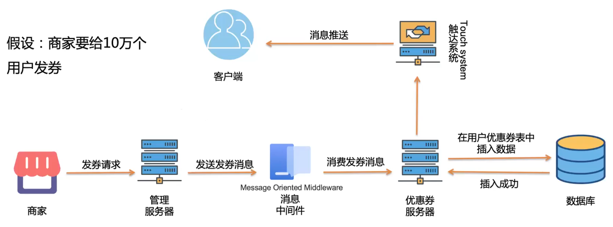
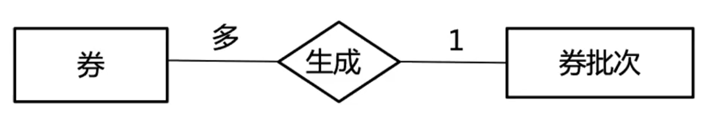
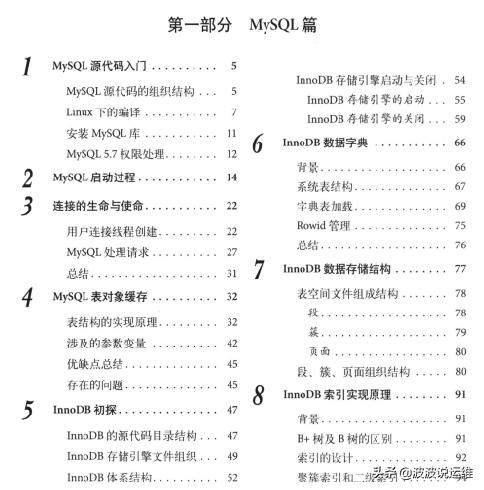
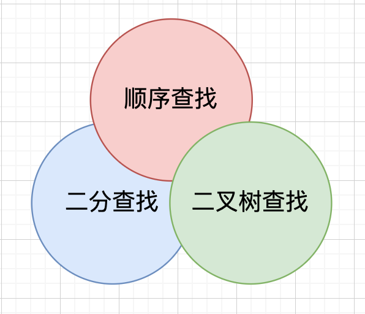

# 系统架构设计 System-Design 2021

> 4S 分析大法 - Scenario，Service，Storage，Scale

## 01-新鲜事系统（News Feed System）

---

## 02-秒杀系统与订票系统（Seckill & Booking System）

---

## 03-用户系统

- 缓存是什么 Cache
- 缓存和数据库如何配合 Cache & Database
- 登录系统如何做 Authentication Service
- 好友关系的存储与查询 Friendship Service
- 关系型与非关系型数据库的使用场景比较 SQL vs NoSQL

- Scenario 场景

  - 注册、登录、查询、用户信息修改
    - 那个需求量最大？
  - 支持 100M DAU
  - 注册、登录、信息修改 QPS 约
    - 100M \* 0.1 / 86500 ~ 100
    - 0.1 = 平均每个用户每天登录+注册+信息修改
    - Peak = 100 \* 3 = 300
  - 查询的 QPS 约
    - 100M \* 100 / 86400 ~ 100k
    - 100 = 平均每个用户每天与查询信息相关的操作次数（查看好友，发信息，更新消息主页）
    - Peak = 100k \* 3 = 300k

- Service 服务
  - 一个 AuthenticationService 负责注册登录
  - 一个 UserService 负责用户信息存储与查看
  - 一个 FriendshipService 负责好友关系存储

为什么要分析 QPS 呢？

因为 QPS 的大小确定了数据存储系统的选择

常见存储的性能：

- MySQL / PostgreSQL 的 SQL 数据库的性能
  - 约 1k QPS 这个级别
- MongoDB / Cassandra 等硬盘型 NoSQL 数据库的性能
  - 约 10K QPS 这个级别
- Redis / Memcached 等内存 NoSQL 数据库的性能
- 以上性能与与机器硬件性能有所区别

### 用户系统的特点

> 读非常多，写非常少
>
> 一个读多写勺得系统，一定要使用 Cache 进行优化

### 缓存

- Cache 是什么
  - 缓存，把之后可能要查询的东西先存一下
    - 下次要的时候，直接从这里拿，无需重新计算和存取数据库等
  - 可以理解为一个 Java 中的 HashMap
  - Key-Value 的结构
- you 那些常用的 Cache 系统/软件？
  - Memcached 不支持数据持久化
  - Redis 支持数据持久化
- Cache 一定是存在内存中吗？
  - 不是
  - Cache 这个概念，并没有指定存在什么样的存储介质中
  - File System 也可以叫做 Cache
    - 🔥 文件系统什么时候可以当做缓存来用？
    - 🔮 当访问速度比文件系统还慢时，就可以用它当缓存，利润网络 IO！
  - CPI 也有 Cache
- Cache 一定指 Server Cache 么？
  - 不是，Fronend、Client、Browser 也可能会有客户端的 Cache

### 登录服务

Session 会话

- 用户 Login 后，为他创建了一个 session 对象
- 并把 session_key 返回给浏览器，让浏览器存储起来
- 浏览器将该值记录在浏览器的 cookie 中
- 每次用户想服务器发送的访问，都会自动带上该网站的所有 cookie
- 此时服务器拿到 cookie 中的 session_key，在 Seesion Table 中肩擦是否存在，是否过期
- Cookie：Http 协议中浏览器和服务器的沟通机制，服务器把一些用于标记用户身份的信息，传递给浏览器，浏览器每次访问任何该网页链接时，都会在 HTTP 请求中带上所有的该网站相关的 cookie 信息。
- Cooke 可以理解为一个 Client 端的 hash table

---

## 05-优惠券系统（Coupons System）

### 核心流程

- **发券**
  - 发券的方式：同步发送 or 异步发送
- **领券**
  - 谁能领：所有用户 or 指定用户
  - 领取上限：一个优惠券最多能领取多少张
  - 领取方式：用户主动领取 or 系统被动发放
- **用券**
  - 作用方式：商品、商户、类目等
  - 计算方式：是否互斥、是否达到门槛等

### 需求拆解

- 商家侧
  - 创建优惠券
  - 发送优惠券
- 用户侧
  - 领取优惠券
  - 下单
  - 使用优惠券
  - 支付

### 优惠券系统难点

- 券的分布式事务，使用券的过程会出现分布式问题分析
- 如何防止超发
- 如何大批量给用户发圈
- 如何限制券的使用条件
- 如何防止用户重复领券

### 表单设计

- 1、券批次（券模板）
  - 指一批优惠券的抽象、模板，包含优惠券的大部分属性。
  - 例：商家创建了一批优惠券，共 1000 张，使用时间为 2021-01-01 00:00:00 ~ 2021-01-31 2359:59
  - 规定只有化妆品类目商品才能使用，满 100 减 50.
- 2、券
  - 发放到用户的一个实体，已与用户绑定；
  - 例：将某批次的优惠券中的一张发送给某个用户，此时优惠券属于用户。
- 3、规则
  - 优惠券的使用有规则和条件限制，比如满 100 减 50 券，需要达到门槛金额 100 元才能使用

### 异步处理思想

特别大的请求里，先不要想着立马把这些请求处理掉，而是先把这些请求存下来，再从存储下来的浏览中，按照能够处理的速度一点点进行处理。

---

## 06-数据库拓展与一致性哈希算法

---

## 08-协同实时编辑系统（Collaboration Real-Time Editor System）

---

## 10-聊天系统（IM System）

---

## 12-物理定位信息服务系统（Location Based Services System）

---

## 15-爬虫系统与搜索建议系统

---

## 16-数据库索引与事务

### 什么是索引

- 生活中的索引 —— **书的目录**

- 目录的特点
  - 单独的结构
  - 指向了具体内容的位置
  - 加速了对书籍内容的查找
  - 有些东西还是没法放到目录里
  - 书籍变厚了

> 🐂 🐂 🐂，真够具象的

### MySQL中的索引

> **索引(Index)是帮组数据库搞笑索取数据的数据结构。**

- 数据库查询时数据库的主要功能之一

- 各种查找算法都有局限。
- 数据库系统还维护着满足特定查找算法的数据结构，这些数据结构以某种方式指向数据，这样就可以再这些数据结构上实现高级算法。

---

## 17-评论系统（Comment System）

### Scenario

- 四个功能
  - 发表文字评论
  - 显示单一评论
  - 删除评论
  - 显示评论列表
- RPS
  - Read： 1000RPS
  - Write：100RPS
- Latency啊哟球
  - 读写 p99 latency below 500ms
  - 为什么不规定Max和Average？
- Scope
  - 注意评论区可以有很多个 (我们把评论区叫做`context`)
  - 不需要设计用户登录系统

### 面试官刁难1：Parameter Location

为什么把 `id` 放在 `URL path` 里，而不是作为一个 `Request Parameter` ？

- 为什么要 `GET /comments/<cid>`
- 而不是 `GET /comments?id=<cid>`

> 原因：放 url path 里则不需要判空id情况，而 request parameter 则需要，或者还需要重定向！
>
> 因为我们本来就要查看一个资源(这里指评论)的详情，所以推荐放 `url path`
